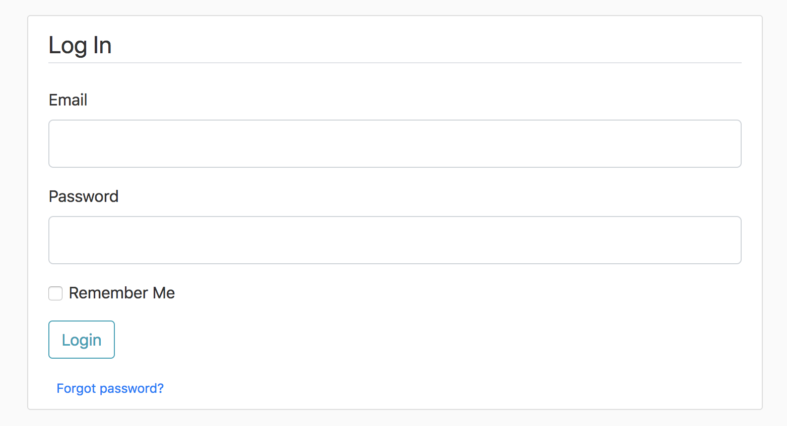

<!--  -->
# Explanation
## flaskblog.py

### Create the secrect key
* In Python CLI, do:
```python
>>> import secrets
>>> secrets.token_hex(16)
```
* Then you will get the key "9c84f73a51cdafc0ad8eae0e5be9ac43" 
* Use it as following:
```python
app.config['SECRET_KEY'] = '9c84f73a51cdafc0ad8eae0e5be9ac43'
```


### Set the path for sqlite file
* **///** means a relative path from the current file
```python
app.config['SQLALCHEMY_DATABASE_URI'] = 'sqlite:///site.db'
```


### Create the sqlite db file
* In Python CLI, do:
```python
>>> from flaskblog import db
>>> db.create_all()
# Then site.db will be created in the same folder of the project.
```

### Adding Data to the Database Manually
* In Python CLI, do:
```python
>>> from flaskblog import db
>>> from flaskblog import User, Post
>>> user_1 = User(username='Neo', email='N@gmail.com', password='password')
>>> db.session.add(user_1)
>>> user_2 = User(username='JohnDoe', email='JD@gmail.com', password='password')
>>> db.session.add(user_2)

# Once you finish adding the new data, commit those changes.
>>> db.session.commit()
```


### Query the Data Manally

```python

# Ouput: [User('Neo', 'N@gmail.com', 'default.jpg'), User('JohnDoe', 'JD@gmail.com', 'default.jpg')]
>>> User.query.all()

# Output: User('Neo', 'N@gmail.com', 'default.jpg')
>>> User.query.first()

# Output: [User('Neo', 'N@gmail.com', 'default.jpg')]
>>> User.query.filter_by(username='Neo').all()

# Output: User('Neo', 'N@gmail.com', 'default.jpg')
>>> User.query.filter_by(username='Neo').first()

# Assign the returned result to a variable
>>> user = User.query.filter_by(username='Neo').first()
>>> user
User('Neo', 'N@gmail.com', 'default.jpg')

# Now, you can access the other attributes.
>>> user.id
1

# Or use different method combined with the id
>>> user = User.query.get(1)
>>> user
User('Neo', 'N@gmail.com', 'default.jpg')

# "posts" attribute isn't acctually a column itself. That is actually running an 
# additional query on the "Post" table that graps any post from that user.
>>> user.posts
[]

# Let's create some posts by this user, so we can see what it looks like.
>>> post_1 = Post(title='Blog 1', content='First Post Content!', user_id=user.id)
>>> post_2 = Post(title='Blog 2', content='Second Post Content!', user_id=user.id)
>>> db.session.add(post_1)
>>> db.session.add(post_2)
>>> db.session.commit()

# Now there is list for the posts related to the user.
>>> user.posts
[Post('Blog 1', '2018-10-15 17:55:23.904816'), Post('Blog 2', '2018-10-15 17:55:23.905997')]

# Loop through the list.
>>> for post in user.posts:
...   print(post.title)
...
Blog 1
Blog 2

# Save the first post to a variable
>>> post = Post.query.first()
>>> post
Post('Blog 1', '2018-10-15 17:55:23.904816')

# Get the id of the user who created this post.
>>> post.user_id
1
```

We might want to get more information about that author by using the **backref**.
* The **posts** relationship from our **User** model lets us not only access that user's posts but it also adds this backref of author to each post.
* **author** is NOT an actual column in the **Post** model but it allows us to use that to access the user who created the post.

```python
# We can get the entire User object that we can work with.
>>> post.author
User('Neo', 'N@gmail.com', 'default.jpg')
```

### Delete All Data from the Database

```python
# Drop all tables and rows in the database
>>> db.drop_all()

# Create all tables again
>>> db.create_all()

# Now the two tables are both empty.
>>> User.query.all()
[]x
>>> Post.query.all()
[]
>>>
```


## models.py

### One-to-many Relationship between Tables
* One-to-many relationship: One user can have multiple posts, but a post can only have one author.
* **backref** is similart to adding a column in the Post model. When we have a post, we can use this author attribute to get the user who created the post.
* **lazy** spefcifies when SQLAlchemy loads the data from the database. True means taht SQLAlchemy will load the data as necessary in one go. This is convenient because with this relationship, we'll be able to simply use this posts attribute to get all the posts created by an individual user.
```python
class User(db.Model):
    id = db.Column(db.Integer, primary_key=True)
    username = db.Column(db.String(20), unique=True, nullable=False)
    email = db.Column(db.String(120), unique=True, nullable=False)
    image_file = db.Column(db.String(20), nullable=False, default='default.jpg')
    password = db.Column(db.String(60), nullable=False)
 
    # "posts" is not a column. Instead, it's just running an additional query
    # in the background that will get of the posts that this user has created.
    posts = db.relationship('Post', backref='author', lazy=True)

    def __repr__(self):
        return f"User('{self.username}', '{self.email}', '{self.image_file}')"


class Post(db.Model):
    id = db.Column(db.Integer, primary_key=True)
    title = db.Column(db.String(100), nullable=False)
    
    # Pass in the utcnow function itself, not calling it.
    date_posted = db.Column(db.DateTime, nullable=False, default=datetime.utcnow)
    content = db.Column(db.Text, nullable=False)
    
    # Note that the ForeginKey is referencing the table name and column
    # name and the convention for table name and column is lowercase.
    user_id = db.Column(db.Integer, db.ForeignKey('user.id'), nullable=False)

    def __repr__(self):
        return f"Post('{self.title}', '{self.date_posted}')"
```


### Circular Import

When we run **python flaskblog.py** now, we will have the following error:
```python
ImportError: cannot import name 'User'
```

Anytime Python imports something from the module, it still runs the entire module. So when it is importing the User and Port classes from the models module, tt's actually running the entire _models.py_ script.

```python
# flaskblog.py
from models import User, Post
```

 It's not just running the section that is being imported. When it runs the entire **models** module, it comes into our _models.py_ script and it tries to perform its imports. Then it gets to this line:

```python
# models.py
# This is where we would expect that this would fail.
from flaskblog import db
```

At this point, we've already seen the **flaskblog** module because that's where we just came from. Then we figured/guessed it would just say hey I've already seen this flaskblog module and I haven't seen this **db** variable you are asking for. The reason I haven't seen this **db** variable yet is because it's created after our import statement.

```python
# flaskblog.py
...
from models import User, Post

...

db = SQLAlchemy(app) # <-- It's down here.
```

Then it would throw an error saying that it can't import this *db* variable. **BUT** it does't do that! it fails on the **User** import. Why does it do that?

What's actually going on here is that when we ran the _flaskblog.py_ on the command line, we are running it directly with Python, and when we run the script directly, Python calls the name of the script **\_\_main\_\_**.

We are running the _flaskblog.py_ script which Python calls \_\_main\_\_, and we say "from models import User, Post". Then it comes in and runs our _models.py_ script. When it gets to the line "from flaskblog import db", Python actually hasn't seen **flaskblog** yet because Python named flakblog **\_\_main\_\_**. So it would actually run our _flaskblog.py_ **for a second time** from the beginning. 

So it comes in the _flaskblog.py_ agian, and then it re-does all these same imports:

```python
# flakblog.py
from flask import Flask, render_template, url_for, flash, redirect
from flask_sqlalchemy import SQLAlchemy
from forms import RegistrationForm, LoginForm
from models import User, Post  # <--
```
It re-runs the models import again, and when it gets to that models import, it says ok I've already seen this model module, but I don't know what this **User** class is. And the reason it doesn't know what this class is is because it is below our import statements in the _models.py_. That's why it fails on the **User** import and not on the **db** import. 

If we were to change the flaskblog import instead to \_\_main\_\_:
```python
# flaskblog.py
from datetime import datetime
from __main__ import db
```
Then this should still give us an error but it should give us the error that we initially expected saying that it can't find the **db** variable instead of failing on the **User**.
```python
ImportError: cannot import name 'db'
```
The reason that it fails on this import now is because it has seen \_\_main\_\_ which represents _flaskblog.py_ but it hasn't created the **db** variable yet.

We could fix this by moving our models import here down below the creation of our **db** variable.
```python
# flaskblog.py
...
db = SQLAlchemy(app)

from models import User, Post  # <--
...
```
Now the script can be run without any error, but the way we sove this problem is really ugly. If we were to run our application where _flaskblog.py_ wasn't set the \_\_main\_\_, then all of this would fail.

For example, when we created our database manually by doing **db.creat_all()** in the command line, that would no longer work.
```python
# In Python console
>>> from flaskblog import db

  File "Flask_Blog/flaskblog.py", line 13, in <module>
    from models import User, Post
  File "Flask_Blog/models.py", line 2, in <module>
    from __main__ import db
ImportError: cannot import name 'db'
```
Now it's looking for **db** in \_\_main\_\_, but \_\_main\_\_ is no longer our _flaskblog.py_ because in this case, python didn't call it \_\_main\_\_.

#### Real Solution for Circular Import Problem
* Set up the code in a way to where we're not running flaskblog directly. That way it won't get that name of \_\_main\_\_.
* We will turn our application into a **package**.
* Using a package will make all of these imports more simple and allow us to separate things out better than we've done now.

##### Steps:
1. Create a folder called _flaskblog_ (with the same name as our application) under the project folder.
2. Under that folder, create a file called **\_\_init\_\_**.
3. Move all files and all folders into thr _flaskblog_ folder except _flaskblog.py._. It should still be under the project root folder.
4. **\_\_init\_\_.py** in our package will be where we initialize our application and bring together different components.
5. Cut out the following imports and **app** statements from _flaskblog.py_ and paste them into _\_\_init\_\.py__.
```python
from flask import Flask, render_template, url_for, flash, redirect
from flask_sqlalchemy import SQLAlchemy
from forms import RegistrationForm, LoginForm

app = Flask(__name__)
app.config['SECRET_KEY'] = '9c84f73a51cdafc0ad8eae0e5be9ac43'
app.config['SQLALCHEMY_DATABASE_URI'] = 'sqlite:///site.db'
# Create the database instance
db = SQLAlchemy(app)
```
6. Create _routs.py_ in the _flaskblog_ package folder.
7. Cut out all the following code and paste in _routs.py_.
```python
from models import User, Post

# dummy data
posts = [
    {
        'author': 'Neo Li',
        'title': 'Blog Post 1',
        'content': 'First post content',
        'date_posted': 'October 13, 2018'
    },
    {
        'author': 'Jane doe',
        'title': 'Blog Post 2',
        'content': 'Second post content',
        'date_posted': 'October 14, 2018'
    }
]


@app.route('/')
@app.route('/home')
def home():
    # You can the second argument wahtever you want.
    # The name will be used in the template as a variable name.
    return render_template('home.html', posts=posts)


@app.route('/about')
def about():
    return render_template('about.html', title='About')


@app.route('/register', methods=['GET', 'POST'])
def register():
    # Create an instance for the form with the class we have defined
    form = RegistrationForm()
    # Check validation
    if form.validate_on_submit():
        flash(f'Account created for {form.username.data}!', 'success')
        return redirect(url_for('home'))
    # flash(f'Account not created!', 'warning')
    return render_template('register.html', title='Register', form=form)


@app.route('/login', methods=['GET', 'POST'])
def login():
    # Create an instance for the form with the class we have defined
    form = LoginForm()
    if form.validate_on_submit():
        if form.email.data == 'admin@blog.com' and form.password.data == 'password':
            flash('You have been logged in!', 'success')
            return redirect(url_for('home'))
        else:
            flash(
                'Login unsuccessful. Please check your username and password.', 'danger')
    return render_template('login.html', title='Login', form=form)
```
Now the _flaskblog.py_ only has the following code:
```python
# flaskblog.py
if __name__ == '__main__':
    app.run(debug=True)
```
8. Becuase right now its only job is just to run the app, we just rename it as _run.py_.
9. Import the **app** to the _run.py_ from our _flaskblog_ package.
```python
# flaskblog is the package name.
# app will be imported from the __init__.py file within that package.
from flaskblog import app
```
10. Modidy the imports in all modules
```python
# run.py
# flaskblog is the package name. app will be imported from the __init__.py file 
# within that package folder.
from flaskblog import app


# __init__.py
from flask import Flask
from flask_sqlalchemy import SQLAlchemy

app = Flask(__name__)
...
db = SQLAlchemy(app)
# For the app to run the routs properly, we need to import the routs, but we still
# need to be careful with the circular import problem.
# The routs.py is also importing the app. We can't import the routes at the top of 
# this file because at that point, the app hasn't been created yet. 
from flaskblog import routs


# routs.py
from flask import render_template, url_for, flash, redirect
from flaskblog import app
from flaskblog.forms import RegistrationForm, LoginForm
from flaskblog.models import User, Post


# models.py
from datetime import datetime
from flaskblog import db


# forms.py
from flask_wtf import FlaskForm
from wtforms import StringField, PasswordField, SubmitField, BooleanField
from wtforms.validators import DataRequired, Length, Email, EqualTo
```

