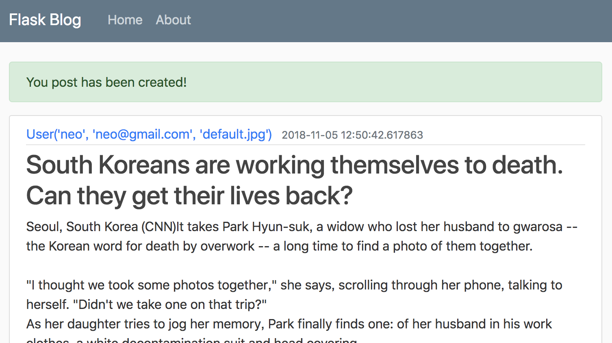
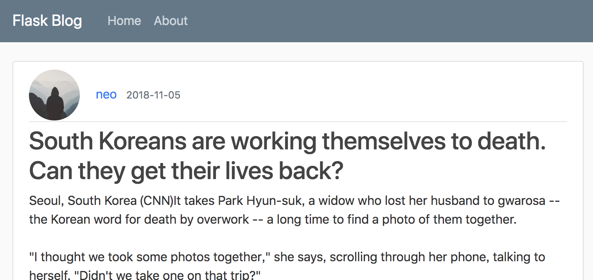

#Create, Update, Delete, and Post

Now that this website can allow the user to register a account, login, and upload their photos, it's time to make the functionality where the users can add, update, and delete the real blog posts.

## Add a new route for creating a new post

_routes.py_
```Python
...

@app.route('/post/new')
@login_required
def new_post():
    return render_template('create_post.html', title='New Post')
```

## Add a new template file:

 _create_post.html_

 ```html
 
 

 
 ```

## Add a Form

The content in the template is just left empty for now. We will put a form in the content area so let's create a new form:

_forms.py_
```Python
...
# Import TextAreaField
from wtforms import StringField, PasswordField, SubmitField, BooleanField, TextAreaField

...

# The new form added
class PostForm(FlaskForm):
    title = StringField('Title', validators=[DataRequired()])
    content = TextAreaField('Content', validators=[DataRequired()])
    submit = SubmitField('Post')
```

## Complete the route handler

Back to _routes.py_
```Python
# We need to import the new form so we can use it in the new route.
from flaskblog.forms import RegistrationForm, LoginForm, UpdateAccountForm, PostForm

...

@app.route('/post/new')
@login_required
def new_post():
    # Create the form object and pass it into the template.
    form = PostForm()
    return render_template('create_post.html', title='New Post', form=form)
```
Since we will allow a form to post back to this route, we will need to accept a POST request.
```Python
@app.route('/post/new', methods=['GET', 'POST'])
@login_required
def new_post():
  ...

```
Now we can accept both Get and Post requests to this route. For now, we just add a flash message that the post has been created and then recirect them back to the home page.
```Python
@app.route('/post/new', methods=['GET', 'POST'])
@login_required
def new_post():
    form = PostForm()
    if form.validate_on_submit():
        flash('You post has been created!', 'success')
        return redirect(url_for('home'))
    return render_template('create_post.html', title='New Post', form=form)
```

## Complete the template

Now, let's add this form to our create_post template. Since this is a similar to what we did so we can grab the form from the login template and change this around to match the fields that we need in our PostForm.
_create_post.html_
```html


<div class="content-section">
  <form method="POST" action="">
    {{ form.hidden_tag() }} <!-- Adding CSRF token -->
    <fieldset class="form-group">
      <legend class="border-bottom mb-4">New Post</legend>
      <div class="form-group">
        {{ form.title.label(class="form-control-label") }}
        
          {{ form.title(class="form-control form-control-lg is-invalid") }}
          <div class="invalid-feedback">
            
            <span>{{ error }}</span>
            
          </div>
        
          {{ form.title(class="form-control form-control-lg") }}
        
      </div>
      <div class="form-group">
        {{ form.content.label(class="form-control-label") }}
        
          {{ form.content(class="form-control form-control-lg is-invalid") }}
          <div class="invalid-feedback">
            
            <span>{{ error }}</span>
            
          </div>
        
          {{ form.content(class="form-control form-control-lg") }}
        
      </div>
    </fieldset>
    <div class="form-group">
      {{ form.submit(class="btn btn-outline-info") }}
    </div>
  </form>
</div>

```

## Add a link to the new route

Let's add a link to our navigation bar so that the logged in user can get to this route easily. The navbar is in the _layout.html_ template.

```html
<!-- Navbar Right Side -->
<div class="navbar-nav">
  
    <a class="nav-item nav-link" href="{{url_for('new_post')}}">New Post</a>
    <a class="nav-item nav-link" href="{{url_for('account')}}">Account</a>
    <a class="nav-item nav-link" href="/logout">Logout</a>
  
    <a class="nav-item nav-link" href="/login">Login</a>
    <a class="nav-item nav-link" href="/register">Register</a>
  
</div>
```

Our current home page is still using the dummy data. Now lets actually save these posts to our database and display those posts on our home page. Also we will delete this old static dummy data that we have been using.

## Add posts to the database

This is going to be similar to when we added a user to our database but it's actually going to be easier than that because we don't need to hash password or anything like that.

We have defined the Post model so here we can use it in the route handler to create the Post object.

_routes.py_
```Python
...

@app.route('/post/new', methods=['GET', 'POST'])
@login_required
def new_post():
    form = PostForm()
    if form.validate_on_submit():
        # We use the back reference of author to set the author of that post
        # instead of setting the user_id. That choice is up tp you. It looks
        # more clean this way.
        post = Post(title=form.title.data, content=form.content.data, author=current_user)
        # Add the post object to the database
        db.session.add(post)
        db.session.commit()

        flash('You post has been created!', 'success')
        return redirect(url_for('home'))
    return render_template('create_post.html', title='New Post', form=form)

```

Now let's change the home page route so that we can actually see these real posts instead of the dummy posts.

First, let's remove the dummy data from the top of the routes file.
```
posts = [
    {
        'author': 'Neo Li',
        'title': 'Blog Post 1',
        'content': 'First post content',
        'date_posted': 'October 13, 2018'
    },
    {
        'author': 'Jane doe',
        'title': 'Blog Post 2',
        'content': 'Second post content',
        'date_posted': 'October 14, 2018'
    }
]

In the _home_ route, let's create a new post variable that is set to our actual posts, and this variable will be passed to the template.
```
_routes.py_
```Python
@app.route('/')
@app.route('/home')
def home():
    posts = Post.query.all()
    # You can set the second argument wahtever you want.
    # The name will be used in the template as a variable name.
    return render_template('home.html', posts=posts)
```
Now let's try to add a post to the database and see how it looks like on the home page.



It looks like we are printing out the entire user object instead of just the author's user name, and the date should only show the date instead of showing the whole time stamp.

It will be also nice to display the user's profile picture with their post as well.

Now let's change those in the html file.

_date_posted_ is a date/time object so we can use the **strftime()** method and pass in the formatting that we want.

To display the user's profile picture, we will put in an img tag with some CSS classes that we added earlier. And we just add the image right on the top of the article.

_post.author_ is a back-reference which gives us access to that entire user and their attributes, and _image_file_ is an attribute of that user.

_home.html_
```html



<article class="media content-section">
	<div class="media-body">
		<div class="article-metadata">
      
			<a class="mr-2" href="#">{{ post.author.username }}</a>
			<small class="text-muted">{{ post.date_posted.strftime('%Y-%m-%d') }}</small>
		</div>
		<h2><a class="article-title" href="#">{{ post.title }}</a></h2>
		<p class="article-content">{{ post.content }}</p>
	</div>
</article>


```
After the change:



## Add the Individual Post Page

**Flask** gives us the ability to add variables within our actual routes so if we wanted to create a route where the id of a post is actually part of the route, then we can create a route that would look like following:

_routes.py_
```Python
@app.route('/post/<post_id>')
def post(post_id):
    ...
```
We can actually put this variable into the URL itself by putting in the angle brackets. Eg., if the user was to go to 'post/1', then _post_id_ would be equal to 1. And then we can pass that post_id into the route handler as an argument.

We can actually make these variables even more specific if we want. Eg., you can specify whether you want to expect that the variable will be a string, an integer, or something like that. Now we are going to be expecting a post id, and that's going to be an **integer**. Then the code becomes like this:
```Python
@app.route('/post/<int:post_id>')
def post(post_id):
    ...
```
**get_or_404()** is a convenient method that just says "give me the post with this id, and if it doesn't exist, then return a 404, which means that the page does not exist."
```Python
@app.route('/post/<int:post_id>')
def post(post_id):
    # Fetch this post if it exists
    post = Post.query.get_or_404(post_id)
    return render_template('post.html', title=post.title, post=post)
```
Now, let's create the template. This will be very similar to our _home.html_ except it will be a single post instead of all of our posts. We also don't nee our title to be a link anymore. The only reason that it is a link on the home page is so that they can link to this page that we are creating now.

_post.html_
```html


<article class="media content-section">
  
  <div class="media-body">
    <div class="article-metadata">
      <a class="mr-2" href="#">{{ post.author.username }}</a>
      <small class="text-muted">{{ post.date_posted.strftime('%Y-%m-%d') }}</small>
    </div>
    <h2 class="article-title">{{ post.title }}</h2>
    <p class="article-content">{{ post.content }}</p>
  </div>
</article>

```

Lastly, we need to actually add the links to this route for the individual post on the home page.
```html
...

<h2><a class="article-title" href="{{ url_for('post', post_id=post.id) }}">{{ post.title }}</a></h2>
<p class="article-content">{{ post.content }}</p>
...

```
Now, when you click the tile, which is also a link, on the home page, it will bring you to the page that only shows the post you clicked. And the title in that page is not a link anymore.

## Add Update functionality

Add a new route:
```Python
...
# Import abort
from flask import render_template, url_for, flash, redirect, request, abort

...

@app.route('/post/<int:post_id>/update')
@login_required  # It requires a login to update a post
def update_post(post_id):
    post = Post.query.get_or_404(post_id)
    # Make sure only the user who write this post can update
    if post.author != current_user:
        abort(403)  # Forbidden route
    # The update form will be the same as the new post form
    form = PostForm()
    return render_template('create_post.html', title='Update Post', form=form)

```
But we want the title and the content to be populated with the existing post that we are updating. Also, we want the form legend to say "Update Post" instead of "New Post".

We don't need to create an entirely separate template just to update the legend of that form. We will just create a legend value that we pass into each template.


```Python
def update_post(post_id):
  ...

  return render_template('create_post.html', title='Update Post',
                            form=form, legend='Update Post')
```
And we will do the same for the new_post route as well:
```Python
def new_post():
    ...

    return render_template('create_post.html', title='Update Post',
                            form=form, legend='New Post')
```

Chage _create_post.html_ so the legend variable can be shown.
```html
...
<fieldset class="form-group">
  <legend class="border-bottom mb-4">{{ legend }}</legend>
...
```
Now we also wanted the form to be populated with the current post title and content on our update page.

_routes.py_
```Python
...
def update_post(post_id):
    ...

    form.title.data = post.title
    form.content.data = post.content
    ...
```
Now we need to add in the logic to update the post if the form validates so we need to accept POST requests to any of these routes that we want to submit a form to.
```Python
@app.route('/post/<int:post_id>/update', methods=['GET', 'POST'])
```

Now we can handle the logic for when that form is submitted.
```Python
@app.route('/post/<int:post_id>/update', methods=['GET', 'POST'])
@login_required
def update_post(post_id):
    post = Post.query.get_or_404(post_id)
    if post.author != current_user:
        abort(403)
    # The update form will be the same as the new post form
    form = PostForm()

    # ----------------------------- added --------------------------
    if form.validate_on_submit():
        post.title = form.title.data
        post.content = form.content.data
        # post is already in the database so we don't need to add it.
        db.session.commit()
        flash('Your post has been updated', 'success')
        return redirect(url_for('post', post_id=post.id))
    elif request.method == 'GET':
        form.title.data = post.title
        form.content.data = post.content
    # ---------------------------------------------------------------

    return render_template('create_post.html', title='Update Post',
                           form=form, legend='Update Post')
```

Now let's add the links for the update and delete routes to our template. For our delete route, we want to add an extra confirmation step to make sure that the user really wants to delete their post make it hard for them to do it by accident.

The update the delete links will be included in the
_post.html_ template. We only want to show these links if the post belongs to the current_user. We also add a Modal for extra confirmation for the delete action.

_post.html_
```html


<article class="media content-section">
  
  <div class="media-body">
    <div class="article-metadata">
      <a class="mr-2" href="#">{{ post.author.username }}</a>
      <small class="text-muted">{{ post.date_posted.strftime('%Y-%m-%d') }}</small>
      
      <div>
        <a class="btn btn-secondary btn-sm mt-1 mb-1" href="{{ url_for('update_post', post_id=post.id) }}">Update</a>
        <button type="button" class="btn btn-danger btn-sm m-1" data-toggle="modal" data-target="#deleteModal">Delete</button>
      </div>
      
    </div>
    <h2 class="article-title">{{ post.title }}</h2>
    <p class="article-content">{{ post.content }}</p>
  </div>
</article>
<!-- Modal -->
<div class="modal fade" id="deleteModal" tabindex="-1" role="dialog" aria-labelledby="deleteModalLabel" aria-hidden="true">
  <div class="modal-dialog" role="document">
    <div class="modal-content">
      <div class="modal-header">
        <h5 class="modal-title" id="deleteModalLabel">Delete Post?</h5>
        <button type="button" class="close" data-dismiss="modal" aria-label="Close">
          <span aria-hidden="true">&times;</span>
        </button>
      </div>
      <div class="modal-footer">
        <button type="button" class="btn btn-secondary" data-dismiss="modal">Cancel</button>
        <form action="{{ url_for('delete_post', post_id=post.id) }}" method="POST">
          <input class="btn btn-danger" type="submit" value="Delete">
        </form>
      </div>
    </div>
  </div>
</div>

```
Now, let's create a route for deleting a post.
```Python
...

@app.route('/post/<int:post_id>/delete', methods=['POST'])
@login_required
def delete_post(post_id):
    post = Post.query.get_or_404(post_id)
    if post.author != current_user:
        abort(403)
    db.session.delete(post)
    db.session.commit()
    flash('Your post has been deleted!', 'success')
    return redirect(url_for('home'))
```
