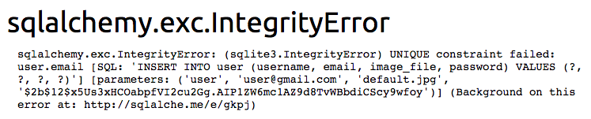
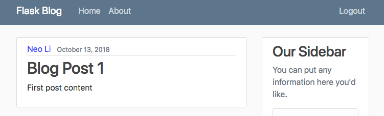
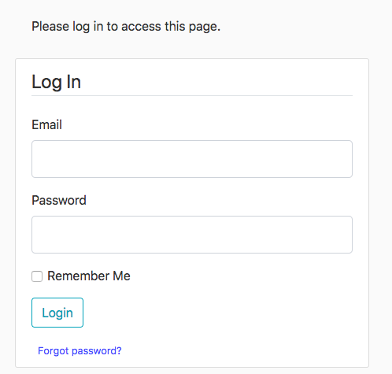
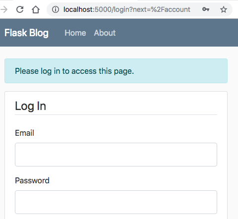

# User Authentication

## Hashing Module
```
$ pip install flask-bcrypt
```
In Python console,
```python
>>> from flask_bcrypt import Bcrypt

# Create the instance
>>> bcrypt = Bcrypt()

# Hash a string
# 'b' at the beginning means that this result is in BYTES
>>> bcrypt.generate_password_hash('testing')
b'$2b$12$nM3S.fXrl047H.DWdInJ4ucUXdVRozhoXP8ATmihCp/dqpXi.aleq'

# Decode the result to utf-8 and then get a regular STRING (without 'b')
>>> bcrypt.generate_password_hash('testing').decode('utf-8')
'$2b$12$jDa90pvIyP8AjRaJCtv33.BSSv7hjAQHDCe1J.bg2xH3O4lWxIwnu'

# Note that even you are hashing the same string, you still get different results each time you hash it.
>>> bcrypt.generate_password_hash('testing').decode('utf-8')
'$2b$12$hRbsy.itBOw/fD6GSLVm4OOms.6/8u2nS9931dHN2ZB4GB.rAMW6q'
```
If it's a different hash every time, then how can we verify if the user enters the correct password?

We need to use another method called _check_password_hash()_ method to check if those passwords are equal. Now let's save the hashed password to a variable. 
```python
>>> hashed_pw = bcrypt.generate_password_hash('testing').decode('utf-8')
>>> hashed_pw
'$2b$12$2wufkIiJGfGrkQnmwnWnC.NwfnXbOkOeZ/bD.Ogy0VuqIVjZntpXi'

# Verify the password
>>> bcrypt.check_password_hash(hashed_pw, 'password')
False
>>> bcrypt.check_password_hash(hashed_pw, 'testing')  # The correct password.
True  
```

### Codes for Hashing

_\_\_init\_\_.py_
```python

...
from flask_bcrypt import Bcrypt
...

bcrypt = Bcrypt(app)
...
```
_routes.py_
```python
# Import db and bcrypt.
# The flaskblog package means we are importing from the __init__.py.
from flaskblog import app, db, bcrypt
...

@app.route('/register', methods=['GET', 'POST'])
def register():
    form = RegistrationForm()
    if form.validate_on_submit():
    	# ----------------- Code added -----------------
        hashed_password = bcrypt.generate_password_hash(form.password.data).decode('utf-8')
        user = User(username=form.username.data, email=form.email.data, password=hashed_password)
        db.session.add(user)
        db.session.commit()
        # ----------------------------------------------
        
        flash('Your account has been created! You are now able to log in.', 'success')
        return redirect(url_for('login'))  # Now, change redirect to the login page
    return render_template('register.html', title='Register', form=form)

```
After creating the user by entering the user's information to the websaite, let's check if the user has been created in our database.
```python
# In Python console 
>>> from flaskblog import db
>>> from flaskblog.models import User
>>> user = User.query.first()
>>> user
User('user', 'user@gmail.com', 'default.jpg')
>>> user.password
'$2b$12$OcRihmokPinUFwCUTxuSWeFXdbeVTzkb1XhiDicXPl91Utr/iKY5m'
```
## Dealing with Information Already Taken
We haven't dealt with the condition where the email has already been in the database. Now let's see what this looks like if we were to try to add another user or email that currently already exists.

You will see the following error message from SQLAlchemy saying that the UNIQUE constraint failed because we restricted the email address to be unique in our model definition.



This is what happens when flask therows an error and you're running in **debug mode**. This information can be extremely useful for debugging problems in your application, but this is also why you want to be absolutely sure that you're **never** running debug mode when you depoly your website publicly. This is just too much information to expose to other people. 

The best way to solve this would be to add our own custom validation for the registration form. That way it gets checked when we actually try to validate the form and we'll return the visual feedback of the error messages like we've seen before. We can create the custom validation simply by creating a function within the registration form.

```python
# forms.py

# Imoport the ValidationError and User
from wtforms.validators import DataRequired, Length, Email, EqualTo, ValidationError
from flaskblog.models import User
...

class RegistrationForm(FlaskForm):
    
    def validate_username(self, username):
        # Return None if there isn't such user
        user = User.query.filter_by(username=username.data).first()
        if user:
            raise ValidationError('That username is taken. Please choose a different one.')

    def validate_email(self, email):
        user = User.query.filter_by(email=email.data).first()
        if user:
            raise ValidationError(
                'That e-mail is taken. Please choose a different one.')

```
## The Login Form
Now we need to create a login system so that our users that have created accounts can login and logout. To do this, we will be using another flask extension called flask-login, which makes it really easy to manage user sessions. 
- Installation
```
$ pip install flask-login
```
In _\_\_init\_\_.py_
```python
from flask_login import LoginManager
...

# Create an instance for it
login_manager = LoginManager(app)
...
```
Now we can add some functionality to our database model, and then it will handle all the sessions in the background for us.


In _models.py_
```python
# Import that instance from our package(__init__.py)
from flaskblog import db, login_manager

# The extension will expect our model to have certain attributes and methods.
# These routines are so common that the flask manager implements a class ready
# for us to inherit.
from flask_login import UserMixin

# Create a function with a decorator for reloading the user from the user ID
# stored in the session. The extension knows how to find one of your users by ID.
# We decorate this function so that the extension knows this is the
# function to get a user by an ID.
@login_manager.user_loader
def load_user(user_id):
    return User.query.get(int(user_id))

# Add one more inheritance from UserMixin for User model.
class User(db.Model, UserMixin):
...

```

In _routes.py_
```python
...
# To login the user
from flask_login import login_user
...

@app.route('/login', methods=['GET', 'POST'])
def login():
    form = LoginForm()
    if form.validate_on_submit():
    	# Query the user with email
        user = User.query.filter_by(email=form.email.data).first()
        # If user exists and the password matches
        if user and bcrypt.check_password_hash(user.password, form.password.data):
            
            # Log in the user with login_user function and set the remember argument 
            login_user(user, remember=form.remember.data)
            return redirect(url_for('home'))
        else:
            flash('Login unsuccessful. Please check your email and password.', 'danger')
    return render_template('login.html', title='Login', form=form)

```
## Login Status

What is strange here is that we're logged in but we can still see our login register routes(buttons) in our navigation bar. If we click on one of those routes, we will get back to the login page even though we've already logged in.

If the user is already logged in and they try to go to the login or register page, then we should probably just redirect them back to the home page because they don't need to be on those pages if they're already logged in to their account.

In order to tell if the user is currently logged in then we can use the _current_user_ varable from the _flask_login_ extension.

In _routes.py_
```python
...
# Import current_user variable
from flask_login import login_user, current_user

...

# Add the following codes to both register and login routes.
def register():
    if current_user.is_authenticated:
        return redirect(url_for('home'))
    ...

def login():
    if current_user.is_authenticated:
        return redirect(url_for('home'))
    ...

```
Now when we try to click on the login and register routes, it just rediects us back to the home page, so the new code is working. 

## Logout Route 
It's still a little strange that we even see the login and register links in our navigation if we're logged in. Most websites will replace those with a logout link if you're logged in.

So let's create a logout route to logout our user, and then we will display, in our navigation when the user is logged in,a logout route. Just like we use the _login_user()_ function to log the user in, we're going to need to use the _logout_user()_ function to log the user out.

In _routs.py_
```python
...
# Import the logout_user function
from flask_login import login_user, current_user, logout_user

...

# Implement the logout route
@app.route('/logout')
def logout():
    # It doesn't take any arguments because it already knows what user is
    # logged in.
    logout_user()
    return redirect(url_for('home'))

```
We also want to see this logout link in the navigation if the user is logged in so in this case we have to change our layout template where the navation is created.

## Change Layout for logged-in User
In _layout.html_ template, add the conditional statements to show the logout link.
```html
	<div class="navbar-nav">
		
			<a class="nav-item nav-link" href="/logout">Logout</a>
		
			<a class="nav-item nav-link" href="/login">Login</a>
			<a class="nav-item nav-link" href="/register">Register</a>
		
	</div>
```
Now when we refresh the home page, we will see the navigation bar showing the logout link because the user's already logged in.



## Restriction on Certain Routes
You can only go to those routes if you are logged in.

Let's create a route for the user's account that they can access after they've logged in. In _routes.py_
```python
@app.route('/account')
def account():
    return render_template('account.html', title='Account', form=form)
```
Create the _account.html_ template:
```html


	<h1>{{ current_user.username }}</h1>

```
Now let's add a link to this route within our navigation if the user is logged in.
In _layout.html_
```html
<div class="navbar-nav">
	
		<a class="nav-item nav-link" href="{{url_for('account')}}">Account</a>
		<a class="nav-item nav-link" href="{{url_for('logout')}}">Logout</a>
	
		<a class="nav-item nav-link" href="{{url_for('login')}}">Login</a>
		<a class="nav-item nav-link" href="{{url_for('register')}}">Register</a>
	
</div>
```
Now when the user is already logged in and click the account link, the user name will be shown on the account page. But the problem is that if we were to log out the user, we can still navigate the account page by manually secifying the url for this page, such as http://DomainName/account. And then the user will see a blank page showing nothing because there is no current_user that is authenticated.

So we want to put a check-in place that makes a user log in before they can access this account page. To do that, we can use login **login_required** decorator from the **flask_login** extension and simply add this decorator to our account route.

In _routes.py_
```python
...
# Import login_required
from flask_login import login_user, current_user, logout_user, login_required

...

@app.route('/account')
@login_required
def account():
    return render_template('account.html', title='Account')
```
Now the extension knows that we need to login to access that route, but we also need to tell the extension where our login route is located.

In _\_\_init\_\_.py_
```python
...

# Set the login route
login_manager.login_view = 'login'  # function name of the route
...

```
Now if the user is not logged in and wants to access the url for account page directly, the login manager will redirect the user to the login page.

The message shown on the login page when is still ugly.


To fix this, let's go back to _\_\_init\_\_.py_ and add the following code:
```python
...

login_manager.login_message_category = 'info'  # Bootstrap class
...

```

One more thing to improve:
It would be nice if, after we're logged in, it would just redirect us back to the page that we are trying to access before it told us that we have to log in.


 
If we look here in the URL after we are prompted the message that tells us to log in, we can see a query parameter here called **next**, and it is euqual to the route ther we were trying to log inot before we got redirected. So in our login route, let's access that query parameter and if it exists, then we will direct the user there after they log in.

In _routes.py_
```python
# To access query parameters, we will need to import the request object.
from flask import render_template, url_for, flash, redirect, request

...

@app.route('/login', methods=['GET', 'POST'])
def login():
    if current_user.is_authenticated:
        return redirect(url_for('home'))
    # Create an instance for the form with the class we have defined
    form = LoginForm()
    if form.validate_on_submit():
        user = User.query.filter_by(email=form.email.data).first()
        if user and bcrypt.check_password_hash(user.password, form.password.data):
            login_user(user, remember=form.remember.data)
            # -------------- Added ----------------
            # args is a dictionary, but you don't want to access next using the 
            # square brackets and key name becaus that would throw an error if the 
            # key doesn't exist, and the next parameter is going to be optinal.
            # If we use the get() method, then it will simply return None if the key
            # doesn't exist.
            next_page = request.args.get('next')
            # Ternary conditional:
            # Redirect to the next_page if the next_page exists, but if it's None
            # or False, then just return redirect to the home page.
            return redirect(next_page) if next_page else redirect(url_for('home'))
            # -------------------------------------
        else:
            flash('Login unsuccessful. Please check your email and password.', 'danger')
    return render_template('login.html', title='Login', form=form)
```
